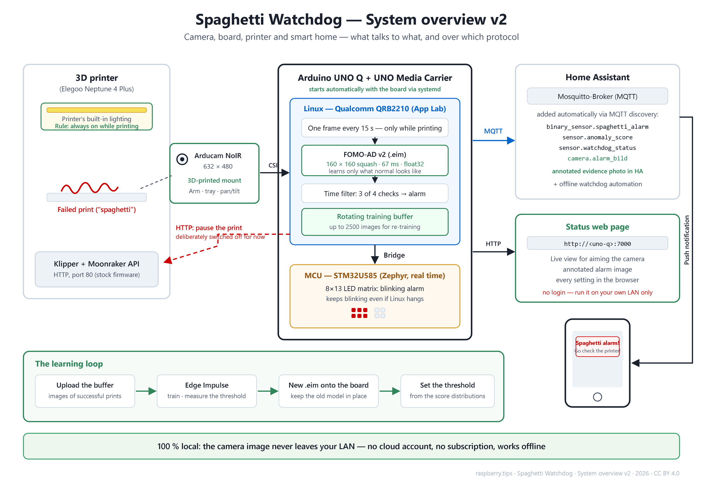
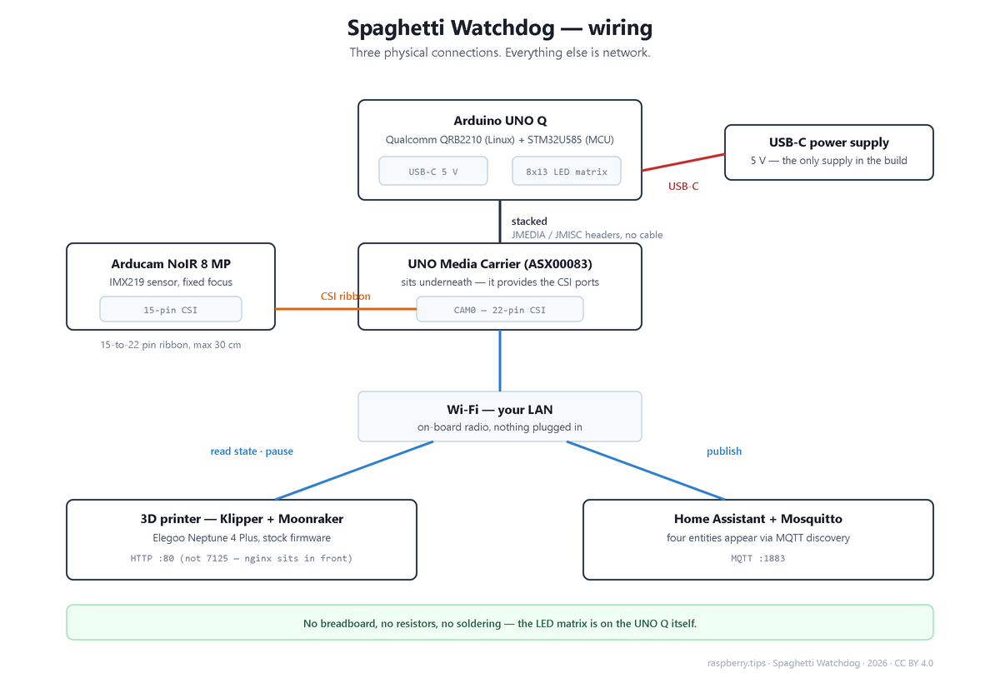
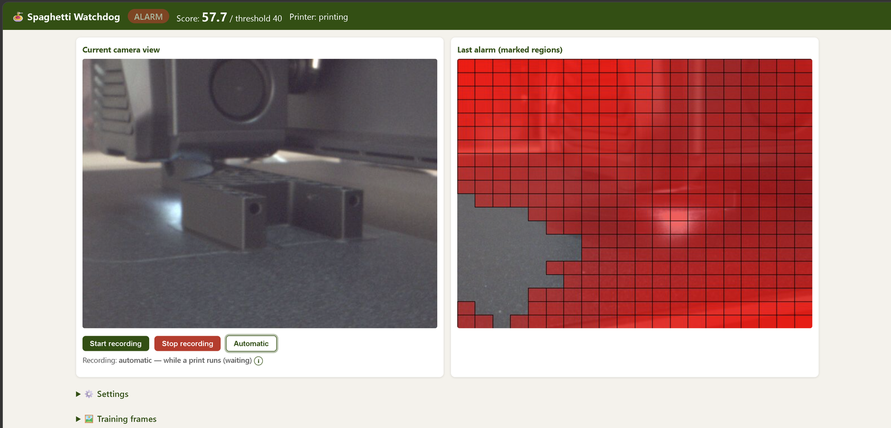
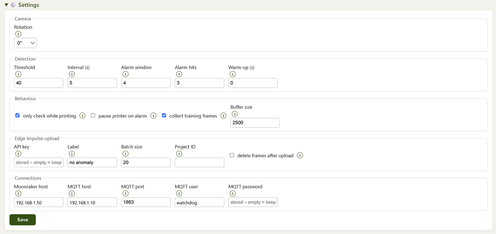
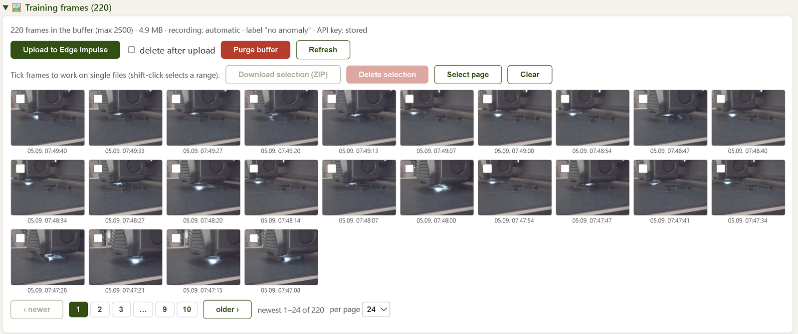

# Spaghetti Watchdog — local AI 3D-print-failure detection on the Arduino UNO Q

A 3D print fails in the first hour and the printer keeps going for another
seven, laying down a bird's nest. This project watches the bed with a camera and
a **self-trained visual anomaly model**, alerts Home Assistant, and can pause the
print through Moonraker. Everything runs on the Arduino UNO Q next to the
printer — no cloud, no subscription, no account.

The model was **trained on good prints only**. It has never been shown a failed
one; it flags spaghetti because it has never seen anything like it.

Written up in a five-part series (German) on
[raspberry.tips](https://raspberry.tips/arduino/arduino-uno-q-druckwaechter-teil-5).



## What is in here

| Folder | Contents |
|---|---|
| [`app/`](app/) | The App Lab application: Python app, Arduino sketch for the LED-matrix alarm, the status web UI, and a ready-to-import `.zip` |
| [`cad/`](cad/) | Camera mount: 8 printable STLs (arm, tray, two adapter variants, washer, camera housing), the parametric FreeCAD source and the scripts that build and export it |
| [`camera-setup/`](camera-setup/) | Bring the CSI camera up, live view for aiming it, frame collector, Edge Impulse upload |
| [`autostart/`](autostart/) | systemd unit so the watchdog comes back after a reboot |

## Hardware



Three physical connections — the camera ribbon, the board-to-carrier stack and USB-C
power. Everything else goes over the network.


- **Arduino UNO Q** (Qualcomm QRB2210 running Debian + STM32U585 MCU)
- **Arduino UNO Media Carrier (ASX00083)** — required, it carries the CSI port
- **Arducam NoIR 8 MP IMX219** camera. Only IMX219 sensors work on the carrier —
  a Raspberry Pi Camera Module 2 is equally fine, a v1 or v3 is not.
  In hindsight the NoIR version was the wrong pick: the image is flat and
  low-contrast. Take the one **with** an IR filter.
- CSI ribbon cable, 15-to-22 pin, ≤ 30 cm · USB-C power supply
- An FDM printer running Klipper with the Moonraker API. Tested on an Elegoo
  Neptune 4 Plus, where **Moonraker answers on port 80** behind nginx — not the
  7125 most tutorials assume.
- The printer's own chamber lighting. No LED strip needed; the rule that matters
  is that it is always on while printing, so the scene stays constant.

## How it works

Every 15 seconds, and only while Moonraker reports `printing`: grab a frame,
score it with the FOMO-AD model, and count it if it is over the threshold.
**Three hits in the last four checks** raise the alarm — a single outlier does
not. On alarm the app latches, publishes to Home Assistant over MQTT (four
entities appear on their own through discovery, including a camera entity with
the evidence photo), lights the LED matrix through the STM32, and — only if you
opted in — asks Moonraker to pause. The latch clears when the print ends.

Inference is **67 ms per frame** (float32; int8 measured *slower* at 119 ms,
there is no integer accelerator here to reward quantisation). The compute was
never the constraint in this project — the image was.

## The status page

The app serves a small web page on port 7000 — no login, so keep it on your own
LAN. Everything below happens there; SSH is only needed once, to register the
model.



*Live view and the last alarm. The three buttons start and stop the
training-frame recording by hand; the default is automatic, collecting only
while a print runs.*



*Every setting is editable at runtime, including the camera rotation in 90°
steps. Secrets are stored on the board and never sent back to the page.*



*The training buffer. Browse what the watchdog collected, upload it to Edge
Impulse in the background, pull single frames as a ZIP or delete them — a print
that only fails near the end still yields both its anomalies and its normal
data.*

## Getting started, step by step

Every step is one thing; if a step fails, nothing after it will work, so do
them in order. The long version with the reasoning behind each step is in the
[write-up](https://raspberry.tips/arduino/arduino-uno-q-druckwaechter-teil-1).

**What you need**

- Arduino UNO Q, the UNO Media Carrier (not optional — it carries the camera
  port), an IMX219 camera (Raspberry Pi Camera Module 2 or an Arducam IMX219;
  take one *with* IR filter), the 15-to-22-pin ribbon cable, a USB-C power
  supply.
- A printer running Klipper with Moonraker. Without Moonraker the watchdog
  still works — switch off *only check while printing* and start the recording
  by hand.
- A free Edge Impulse account. Optional: Home Assistant with the Mosquitto
  add-on for alarms on your phone.
- A computer with an SSH client for exactly two moments: the camera setup and
  registering your model.

**1. Print and fit the mount** — [`cad/`](cad/)

- Print arm, tray, pan/tilt adapter and camera housing. PLA, 0.2 mm layers,
  4–5 wall lines. Support only for the two pins on the back of the tray.
- Clamp the arm to the Z column, drop the board into the tray, mount the
  camera. Aim it so the **whole bed** is in view and the print head cannot hide
  the part in the first layers. Then tighten everything and do not touch it
  again — the model learns the background, and a moved camera invalidates
  every frame you collected.

**2. Bring the board up** — [`camera-setup/`](camera-setup/)

- Get App Lab running on the UNO Q with a current image (Arduino's guide).
- In App Lab: *Settings → Carriers → enable the Media Carrier → Camera0
  "type1-2lanes" → Apply and reboot*. Check over SSH with `cam -l` that the
  camera is listed.

**3. Import the app** — [`app/spaghetti-waechter.zip`](app/spaghetti-waechter.zip)

- Download the zip. In App Lab click *Import App* and pick it (or
  `arduino-app-cli app import spaghetti-waechter.zip` over SSH). Click *Run*.
  The first start pulls Docker images and takes a few minutes.
- It starts with a built-in placeholder model and threshold 100, so nothing
  alarms — observer mode, on purpose: you cannot train a model before you have
  collected frames, and App Lab will not start the app without *some*
  registered model (`Model … Not Found`, before the container even comes up).
- Open `http://<board-ip>:7000`. The header shows *Model:
  concrete-crack-anomaly-detection (built-in placeholder)* in orange. That is
  correct for now.
- If you used the camera-setup scripts before: `sudo systemctl disable --now
  liveview capture` — the camera can only have one user.

**4. Fill in the settings** (⚙️ Settings on the status page)

- *Connections*: Moonraker host is the printer's IP (on an Elegoo Neptune 4
  Plus Moonraker answers on port 80 — the app handles that). MQTT host, user
  and password only if you use Home Assistant; the user must be a Home
  Assistant *user*, not a person. MQTT settings apply after an app restart,
  everything else immediately.
- *Camera*: rotation, until the live view is the right way up.
- *Edge Impulse upload*: create a project in the Studio first — **Project info →
  Labeling method: one label per data item** (not object detection, or every
  upload lands unlabelled). Paste an API key from *Dashboard → Keys*; add the
  project ID if you want the app to cross-check the sample count after
  uploads. The key stays on the board and is never shown again.
- Save. Then home the printer, take a photo of the camera view in that pose,
  and keep it as your reference. After every knock, compare.

**5. Collect normal prints**

- Just print. While Moonraker reports *printing*, every frame goes into the
  training buffer automatically. Print different colours, at different times
  of day, with the same camera position. Several hundred frames are a start,
  a few thousand are better.
- Without Moonraker, or for a specific scene: *Start recording* under the live
  view saves every frame right away; *Automatic* goes back to the default.
- Ignore the scores and the green cells for now — they come from the
  placeholder and mean nothing.

**6. Upload to Edge Impulse** (🖼️ Training frames on the status page)

- Look through the gallery (delete frames with your hands in them), click
  *Upload to Edge Impulse*. Wait until the Studio's sample count matches, then
  *Purge buffer*.
- Stage a few failures for the test set: put a tangle of loose filament on the
  bed with the printer idle, press *Start recording* for a minute, then
  *Stop*, tick those frames in the gallery, *Download selection (ZIP)*, delete
  them from the buffer, and upload the ZIP in the Studio under *Data
  acquisition → Testing* with the label `anomaly`. Ten to twenty are plenty.

**7. Train**

- Studio → *Impulse design*: image 160 × 160, resize mode **squash**; learning
  block **Visual Anomaly Detection (FOMO-AD)** — it hides behind *Show all
  blocks*, and the block just called "Anomaly Detection" is the wrong one
  (1-D sensor autoencoder).
- *Dashboard → Danger zone → Perform train/test split*, then check that your
  `anomaly` samples are still in the test set.
- *Generate features*, then *Train*. Expect half an hour.
- *Model testing*: ignore the accuracy number. Look at the score
  distributions — the highest normal scores and the lowest anomaly scores.
  Your threshold goes into the gap between them, if there is a gap. If there
  is none, collect more normal frames of the scenes that score high.

**8. Put the model on the board**

- *Deployment* → target *Linux (AARCH64)*, float32 → build → download the
  `.eim`.
- Over SSH (or WinSCP): copy it to `~/.arduino-bricks/ei-models/<your-name>.eim`
  and `chmod +x` it. Create
  `~/.arduino-bricks/models/custom-ei/<your-name>/model.yaml` — format below.
  Check with `arduino-app-cli model list` that your name appears.
- In `~/ArduinoApps/spaghetti-waechter/app.yaml` replace
  `concrete-crack-anomaly-detection` with your name. Restart the app in App
  Lab. The header now shows your model.

```yaml
# ~/.arduino-bricks/models/custom-ei/<your-name>/model.yaml
id: "<your-name>"
name: "<any display name>"
runner: "brick"
description: "FOMO-AD visual anomaly model for the print watchdog"
bricks:
- id: "arduino:visual_anomaly_detection"
  model_configuration:
    EI_V_ANOMALY_DETECTION_MODEL: "/home/arduino/.arduino-bricks/ei-models/<your-name>.eim"
```

**9. Set the threshold and watch**

- Enter your threshold in *Settings → Detection*. Leave *pause printer on
  alarm* off.
- Print, and watch the model view. Green on the print and dark elsewhere is
  what you want. Bright cells on the frame, gantry or bed edge mean the model
  has not seen enough of that region: keep collecting, retrain later.
- When an alarm fires, look at the frozen alarm image, then decide: *Reset
  alarm* if it should stay armed, *False alarm* if the scene is fine and you
  want quiet until the print ends. Only when you trust it, switch auto-pause
  on.

**10. Optional: survive a reboot, and Home Assistant** — [`autostart/`](autostart/), [`app/ha/`](app/ha/)

- App Lab does not start apps after a reboot. The systemd unit and script in
  `autostart/` do; two commands, documented there.
- Home Assistant finds the device by itself through MQTT discovery: alarm,
  score, status, the alarm image as a camera entity and the two acknowledge
  buttons. An example automation for a phone notification is in `app/ha/`.

## An honest note on the threshold

There is no threshold value worth copying from someone else — the score depends
on your scene, your light and your camera. On my setup, normal frames scored
between 24 and 63 and staged failures between 40 and 60: the ranges **overlap**.
A threshold of 40 caught every failure at the cost of 4 % false alarms, and when
I armed it, it cried wolf after four minutes on a perfectly good print, because
bright empty areas of the bed were under-represented in the training data.

The three-of-four time filter does not save you there: it rejects isolated
outliers, and a bright region is not an outlier — it stays in frame. Worse, the
training buffer only keeps frames *below* the threshold, so the very images the
model needs in order to improve are the ones it refuses to collect.

The watchdog therefore ships in **observer mode**: threshold 100, auto-pause off.
It watches, scores and records without alarming. That is the honest starting
point, and the way forward is more data, not a cleverer filter.

## Licence

| Material | Licence |
|---|---|
| Code — Python, Arduino sketch, shell scripts, the App Lab app | **MIT**, see [LICENSE](LICENSE) |
| CAD and 3D-printing files in [`cad/`](cad/) — STL, FCStd and the renderings | **CC BY 4.0** |

All of it is original work: the training images were captured on my own printer,
and the mount was designed from scratch — first as a non-parametric CAD model,
then rebuilt by hand as the parametric FreeCAD document included here.

The folder READMEs are in German; this page and the summary at the top of
[`cad/README.md`](cad/README.md) are in English.
