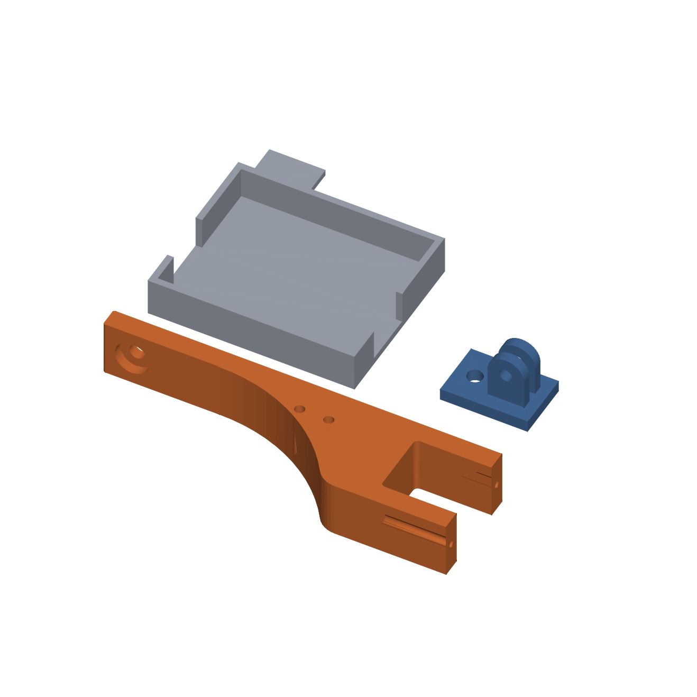

# Spaghetti Watchdog — local AI 3D-print-failure detection on the Arduino UNO Q

A 3D print fails in the first hour and the printer keeps going for another
seven, laying down a bird's nest. This project watches the bed with a camera and
a **self-trained visual anomaly model**, alerts Home Assistant, and can pause the
print through Moonraker. Everything runs on the Arduino UNO Q next to the
printer — no cloud, no subscription, no account.

The model was **trained on good prints only**. It has never been shown a failed
one; it flags spaghetti because it has never seen anything like it.

Written up in a five-part series (German) on
[raspberry.tips](https://raspberry.tips/arduino/arduino-uno-q-druckwaechter-teil-5).

## What is in here

| Folder | Contents |
|---|---|
| [`app/`](app/) | The App Lab application: Python app, Arduino sketch for the LED-matrix alarm, the status web UI, and a ready-to-import `.zip` |
| [`cad/`](cad/) | Camera mount: 5 printable STLs, the parametric FreeCAD source and the scripts that build and export it |
| [`camera-setup/`](camera-setup/) | Bring the CSI camera up, live view for aiming it, frame collector, Edge Impulse upload |
| [`autostart/`](autostart/) | systemd unit so the watchdog comes back after a reboot |

## Hardware

- **Arduino UNO Q** (Qualcomm QRB2210 running Debian + STM32U585 MCU)
- **Arduino UNO Media Carrier (ASX00083)** — required, it carries the CSI port
- **Arducam NoIR 8 MP IMX219** camera. Only IMX219 sensors work on the carrier —
  a Raspberry Pi Camera Module 2 is equally fine, a v1 or v3 is not.
  In hindsight the NoIR version was the wrong pick: the image is flat and
  low-contrast. Take the one **with** an IR filter.
- CSI ribbon cable, 15-to-22 pin, ≤ 30 cm · USB-C power supply
- An FDM printer running Klipper with the Moonraker API. Tested on an Elegoo
  Neptune 4 Plus, where **Moonraker answers on port 80** behind nginx — not the
  7125 most tutorials assume.
- The printer's own chamber lighting. No LED strip needed; the rule that matters
  is that it is always on while printing, so the scene stays constant.

## How it works

Every 15 seconds, and only while Moonraker reports `printing`: grab a frame,
score it with the FOMO-AD model, and count it if it is over the threshold.
**Three hits in the last four checks** raise the alarm — a single outlier does
not. On alarm the app latches, publishes to Home Assistant over MQTT (four
entities appear on their own through discovery, including a camera entity with
the evidence photo), lights the LED matrix through the STM32, and — only if you
opted in — asks Moonraker to pause. The latch clears when the print ends.

Inference is **67 ms per frame** (float32; int8 measured *slower* at 119 ms,
there is no integer accelerator here to reward quantisation). The compute was
never the constraint in this project — the image was.

## Getting started

The order matters, and it is the opposite of what you might expect.

1. **Print the mount and fix the camera position.** Do this first. The anomaly
   model learns the background along with the print, so once you start
   collecting, the camera must not move again. Home the printer, photograph that
   pose, and keep it as a reference to check against after every knock.
2. **Import the app** — download
   [`app/spaghetti-waechter.zip`](app/spaghetti-waechter.zip) and use *Import
   App* in App Lab, or `arduino-app-cli app import spaghetti-waechter.zip`.
   It starts immediately: the shipped `app.yaml` names the built-in
   `concrete-crack-anomaly-detection` model as a placeholder and the threshold is
   100, so nothing ever alarms. Without *some* registered model App Lab refuses
   to start the app at all (`Model … Not Found`, before the container even
   comes up) — that is the chicken-and-egg every rebuilder hits first.
3. **Collect normal frames** during ordinary prints. Perspective must not
   change; colour and light *should*. Several hundred to a few thousand.
4. **Train** a Visual Anomaly Detection (FOMO-AD) impulse in Edge Impulse, free
   developer plan. Deploy as a Linux AArch64 `.eim`.
5. **Register your model** — put the `.eim` in `~/.arduino-bricks/ei-models/`
   (`chmod +x`), add a `model.yaml` under
   `~/.arduino-bricks/models/custom-ei/<name>/`, then point `app.yaml` at it.
6. **Find your own threshold** from your own score distributions, and leave
   auto-pause off until you trust it.

Details for each step are in the folder READMEs.

## An honest note on the threshold

There is no threshold value worth copying from someone else — the score depends
on your scene, your light and your camera. On my setup, normal frames scored
between 24 and 63 and staged failures between 40 and 60: the ranges **overlap**.
A threshold of 40 caught every failure at the cost of 4 % false alarms, and when
I armed it, it cried wolf after four minutes on a perfectly good print, because
bright empty areas of the bed were under-represented in the training data.

The three-of-four time filter does not save you there: it rejects isolated
outliers, and a bright region is not an outlier — it stays in frame. Worse, the
training buffer only keeps frames *below* the threshold, so the very images the
model needs in order to improve are the ones it refuses to collect.

The watchdog therefore ships in **observer mode**: threshold 100, auto-pause off.
It watches, scores and records without alarming. That is the honest starting
point, and the way forward is more data, not a cleverer filter.

## Licence

| Material | Licence |
|---|---|
| Code — Python, Arduino sketch, shell scripts, the App Lab app | **MIT**, see [LICENSE](LICENSE) |
| CAD and 3D-printing files in [`cad/`](cad/) — STL, FCStd and the renderings | **CC BY 4.0** |

All of it is original work: the training images were captured on my own printer,
and the mount was designed from scratch — first as a non-parametric CAD model,
then rebuilt by hand as the parametric FreeCAD document included here.

The folder READMEs are in German; this page and the summary at the top of
[`cad/README.md`](cad/README.md) are in English.
